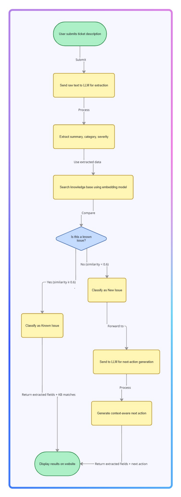
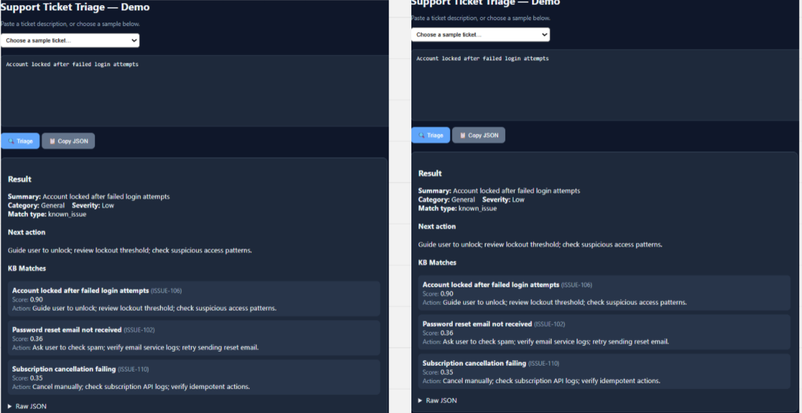
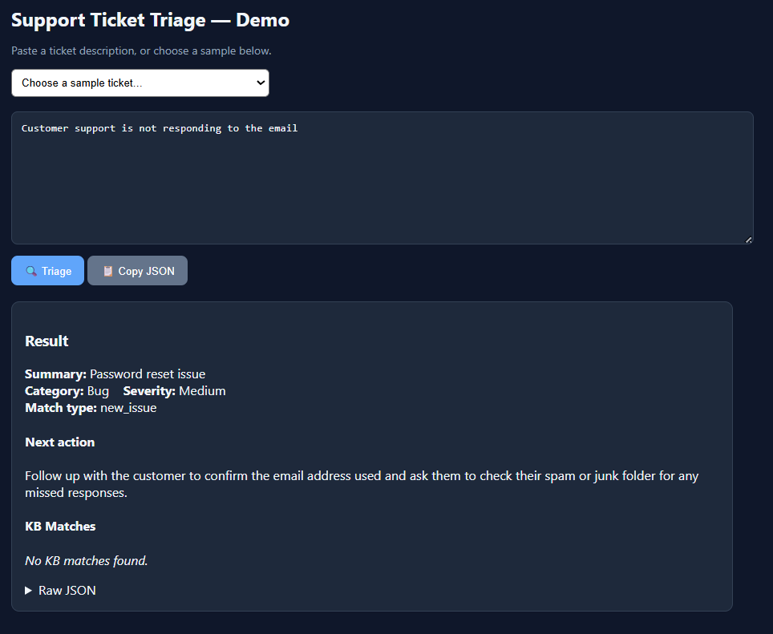
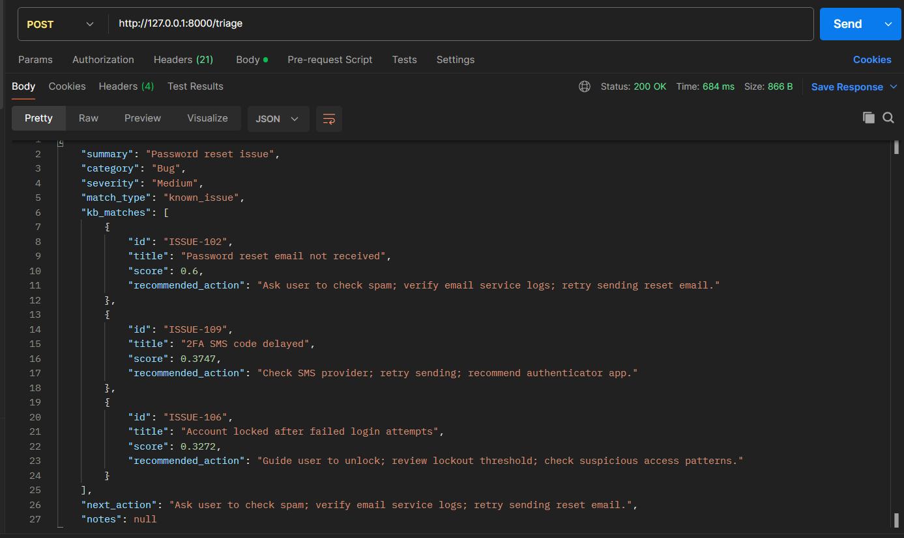

# Ticket Triage Agent — AI-Powered Support Automation  
_Designed & implemented by **Samarth S Shetty**_


#  Overview

This project implements a production-ready **AI Support Ticket Triage Agent**, developed for the **AI Engineer (Agents & Production)** role assignment.

The system demonstrates real-world production thinking by combining:

- **LLM extraction**  
- **Embedding-based knowledge base search**  
- **FastAPI backend**  
- **Intelligent next‑action generation for new issues**  
- **A minimal UI, rate limiting, testing, and Dockerization**  

---

#  System Workflow (High-Level Architecture)



### **How the workflow operates**
1. **User submits a support ticket** through UI or API.  
2. **LLM extracts structured fields** from raw text:  
   - summary  
   - category  
   - severity  
3. Ticket description is compared to a mock KB using **embedding similarity search**.  
4. If similarity score ≥ **0.6**, classify as **known_issue**:  
   - Top KB matches returned  
   - KB recommended action used  
5. If score < 0.6, classify as **new_issue**:  
   - LLM generates a custom next‑action suggestion  
   - No KB matches shown  
6. Response is returned to the UI / API.

### Why this design?
- **Embedding search is extremely fast** → ideal for production  
- **LLM only used when reasoning is needed** → lowers cost  
- Ensures **consistent triaging**, even when KB doesn’t contain the issue  

---

# 🔍 Why Embeddings Instead of LLM Matching?

This project intentionally uses **embeddings**, not LLM comparison, because:

### ✔ Scalability
LLM comparison does not scale.  
Embedding search scales to **thousands of KB articles**.

### ✔ Cost efficiency
Embedding search is nearly free.  
LLM comparison for every KB entry is **expensive**.

### ✔ Latency
- Embeddings → <10ms  
- LLM similarity → 500ms–2s per call

### ✔ Better semantic matching
Embeddings capture meaning, not literal wording:
- “Account locked after failed login attempts”  
≈  
- “App locks me out after multiple wrong logins”

Embeddings increase accuracy without increasing cost.

This design shows production-level optimisation:  
**LLMs for intelligence, embeddings for speed + scale.**

---


#  Cloning This Repository

## **Method 1: Standard Git Clone**
### 1. Clone the repository
```bash
git clone https://github.com/Samarth-S-Shetty/ticket-triage-agent
```

### 2. Enter the project directory
```bash
cd ticket-triage-agent
```

---

## **Method 2: Clone via VS Code (Easiest)**

### 1. Open VS Code Command Palette  
```
Ctrl + Shift + P
```

### 2. Type:
```
Git: Clone
```

### 3. Paste the GitHub URL  
```
https://github.com/Samarth-S-Shetty/ticket-triage-agent
```

### 4. Choose a local folder  

### 5. Click:
```
Open cloned repository?
```
---

# Installation & Running
### 1. Create environment & install dependencies

#### Using uv (recommended)
```bash
uv venv
uv pip install -r requirements.txt
```

#### Using pip
```bash
python -m venv .venv
source .venv/bin/activate   # Linux/Mac
.venv\Scripts\activate      # Windows PowerShell

pip install -r requirements.txt
```

### 2. Set up environment variables
```bash
cp .env.example .env
```

Add your API key:
```env
OPENAI_API_KEY=your_api_key_here
```

## 3.Run Command (using UV)
```bash

uvicorn app.main:app --reload
```

###  Run Command (using pip)
```bash

uvicorn app.main:app --reload
```

---

# 🌐 Access UI
### 🖥 How to Use the Web UI

Once the server is running, open:


```
http://127.0.0.1:8000/ui

```
This simple HTML interface allows you to:

- Enter a ticket description  
- Submit it directly to the backend  
- View the triage response on-screen  

The UI is intentionally minimal — it exists to demonstrate usability and quick manual testing.


# 📘 API Docs
### 📘 How to Use the Interactive API Docs

FastAPI automatically generates API documentation.

Visit:
```
http://127.0.0.1:8000/docs
```
Here you can:

- See all routes  
- Try the `/triage` endpoint interactively  
- View request/response models  
- Test different inputs without Postman  

This is extremely useful for debugging and demonstrating the backend.

---

# 💻 Curl Example
```bash
curl -X POST http://127.0.0.1:8000/triage      -H "Content-Type: application/json"      -d '{"description": "Account locked after failed attempts"}'
```


---


# 📝 Feature Showcase (UI Demo)

## ✅ Known Issue Example



### Explanation
- Embedding score was **high (~0.90)**  
- Mapped correctly to existing KB entry  
- KB’s recommended action was applied  
- Demonstrates embedding power  

---

## 🆕 New Issue Example



### Explanation
- Similarity < threshold → **new_issue**  
- No KB matches shown  
- Description passed to **LLM to generate next action**  
- Intelligent suggestion returned:
  > “Ask user to confirm email and check spam folder.”

This ensures **continuous usefulness**, even for issues not in KB.

---

# 📬 Postman Example (API Demo)



### Explanation
- Simple POST request to `/triage`  
- JSON payload with ticket description  
- API returns:
  - summary  
  - category  
  - severity  
  - match_type  
  - KB matches (only for known issues)  
  - next_action  

This demonstrates the API’s clean, production-ready interface.
### 🔎 How to Test with Postman

Follow these steps to test the triage API using Postman:

1. **Open Postman**
2. Click **New → HTTP Request**
3. Select **POST**
4. Enter the API URL:
```Arduino
    http://127.0.0.1:8000/triage
```
5. Go to the **Body** tab  
6. Select **raw**  
7. Change the format to **JSON**  
8. Paste a ticket description, for example:
```json
 {
  "description": "I am not receiving password reset emails."
  }
```
9. Click **Send**

You will receive a structured JSON response containing:
- summary  
- category  
- severity  
- match_type  
- kb_matches (only for known issues)  
- next_action

This lets you manually verify the API behaviour live while the app is running.

---

# 🔧 API Specification

## **POST `/triage`**

### Request
```json
{
  "description": "User cannot log in due to repeated failures"
}
```

### Response (Known Issue)
```json
{
  "summary": "Login failure due to repeated lockouts",
  "category": "General",
  "severity": "Low",
  "match_type": "known_issue",
  "kb_matches": [...],
  "next_action": "Guide user to unlock; review lockout threshold."
}
```

### Response (New Issue)
```json
{
  "summary": "...",
  "category": "Bug",
  "severity": "Medium",
  "match_type": "new_issue",
  "kb_matches": [],
  "next_action": "Ask for logs and reproduction steps."
}
```

---

# 🧩 Project Structure

```
ticket-triage-agent/
│
├── agent/           # LLM JSON-mode extraction logic
├── app/             # FastAPI service + orchestrator
├── kb/              # KB JSON + embedding search system
├── frontend/        # Minimal UI for testing
├── tests/           # Pytest suite
├── images/          # README image assets
├── .env.example
├── Dockerfile
├── requirements.txt
└── README.md
```


---

# 🧪 Testing
### &ensp; How to Run Tests

Tests are located in the `tests/` folder and cover:

- Health check  
- Triage endpoint response shape  
- Known issue classification  
- New issue handling  
- Error handling (empty descriptions)

Run all tests using:

```bash
pytest -q
```
The tests ensure that the API behaves correctly and that future changes do not break core functionality.

# 📦 Docker Support

### Dockerfile explanation
The Dockerfile:

- Uses **python:3.12-slim** for lightweight production images  
- Installs dependencies using `requirements.txt`  
- Exposes port 8000  
- Runs `uvicorn`  

This matches modern production deployment patterns.

---

### Build:
```bash
docker build -t ticket-triage-agent .
```

### Run:
```bash
docker run -p 8000:8000 ticket-triage-agent
```

---

# 🏭 Production Considerations  
(Required by assignment — fully implemented)

## **1. Deployment (AWS/GCP/Azure)**  
This service is cloud-ready due to:
- Dockerized container  
- Stateless FastAPI server  
- Can run on:
  - AWS ECS / Fargate  
  - GCP Cloud Run  
  - Azure App Service  
  - Kubernetes  

Scaling model:
- Horizontal scaling → multiple container replicas  
- Autoscaling based on:
  - CPU usage  
  - Requests/sec  
  - LLM latency  

---

## **2. Logging & Monitoring**
Production-level monitoring should include:

### Logging
- Structured JSON logs  
- Captures:
  - request_id  
  - latency  
  - LLM success/failure  
  - KB match scores  

### Monitoring tools
- AWS CloudWatch  
- Datadog  
- NewRelic  
- GCP Logging  

### Alerts
- High LLM failure rate  
- Spike in new issues  
- Increased latency  

---

## **3. Configuration & Secrets**

### Local:
- `.env.example` → `.env`
- Environment variables loaded via `python-dotenv`

### Production:
Use a secure secret manager:
- AWS Secrets Manager  
- GCP Secret Manager  
- Azure Key Vault  

No secrets inside:
- Repository  
- Docker image  

Configuration stored in:
- Env variables  
- SSM (AWS Systems Manager)  

---

## **4. Latency, Cost & Rate Limiting**

### Latency handling
- Embedding search → extremely fast  
- LLM used sparingly  
- Caching possible

### Cost control
- Minimized LLM calls: only extraction + new issue reasoning  
- All similarity handled via embeddings  

### Rate limiting
- 1 request per second per IP  
- Protects LLM usage from abuse  
- Prevents accidental API spam  

This ensures predictable cost + performance.

---

# 📌 Assignment Requirements Covered

✔ Mock KB (10–15 entries)  
✔ LLM extraction  
✔ Embedding search  
✔ Known/new issue system  
✔ Next‑action generation  
✔ Clean FastAPI API  
✔ README with production considerations  
✔ Dockerfile  
✔ UI + tests + rate limiting  

---

# 🙏 Final Notes

This project demonstrates:

- Real agent architecture  
- Practical LLM integration  
- Scalable embedding systems  
- Production deployment readiness  
- Modern API design  
- Testing & Dockerization  

If you want improvements or a walkthrough, feel free to ask!

